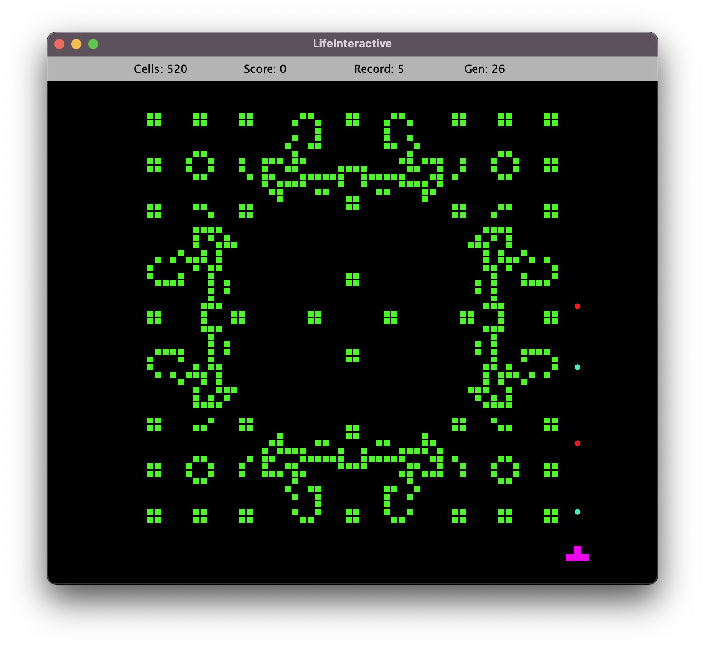

## LifeInteractive

### A Twist on Conway's *Game of Life*:

A simple "tank" game serves as a means of interacting with the evolution of Conway's cellular automaton. 

Check out a video demo [here](https://youtu.be/oIBqgyq9cdk), or play the game by loading the .jar file [here](/out/artifacts/LifeInteractive_jar/LifeInteractive.jar).

### Gameplay:

A grid of cells evolves "naturally" from an initial state
in accordance with the rules of Conway's Game. 
The user navigates a tank-shaped avatar with directional keys, 
and fires projectiles in the facing direction. 
With each tick, the tank moves and projectiles travel in their
initial direction of travel, up to a maximum distance.

There are projectiles of four sorts:  
- **Bullets** are fired with the 'x' key. 
If a bullet collides with a live cell, the cell dies of unnatural causes. 

- **Seeds** are fired with the 'z' key. If a seed collides with a live cell, artificial
life is generated immediately adjacent to the point of collision.

- **Death rays** are fired with the 's' key. A death ray is *like* a bullet, 
in that it causes a life-form to evolve *as if* the cell it is passing through were dead, 
without actually killing the cell. 

- **Life rays** are fired with the 'a' key. They are
to seeds as deaths ray are to a bullets; in both cases, the effects
are statistical.   

The game is what you make of it. It can be paused and then saved (or quit) at any time with the 'space' key, 
and it is over if either of these conditions obtain:

- the tank collides with a cell
- there are no live cells remaining  

or if (by default) 1000 generations of cells have lived and died. 

Scoring is based on a "harvest" model. For each cell killed by a bullet, the player receives a point, whereas for each seed implanted,  the player loses a point (if they have any). So, one accrues more points
by cultivating the life-form than by shooting indiscriminately.  

### Intention:
The game itself ought to be fun, of course, but the program was/is a "sandbox" for myself, so there are a number of boolean "toggles" in the code; e.g. toggling 'devMode' in the NavPanel class will add a 'surprise' button to the menus, which runs (one's choice of) additional code. The general idea may eventually be of use to me as a testing ground for simple game-playing agents and/or multi-agent systems; e.g. have another agent interact with the board by selecting a single cell per generation to "flip", as decided by search of a game tree, then automate the tank(s) to play optimally against such an agent... maybe, one day. Hopefully it is of interest to someone else, for some reason.

### TODO:
- Add GUI support for loading famous initial boards from data/resources/seedLib.json

### Structure:

